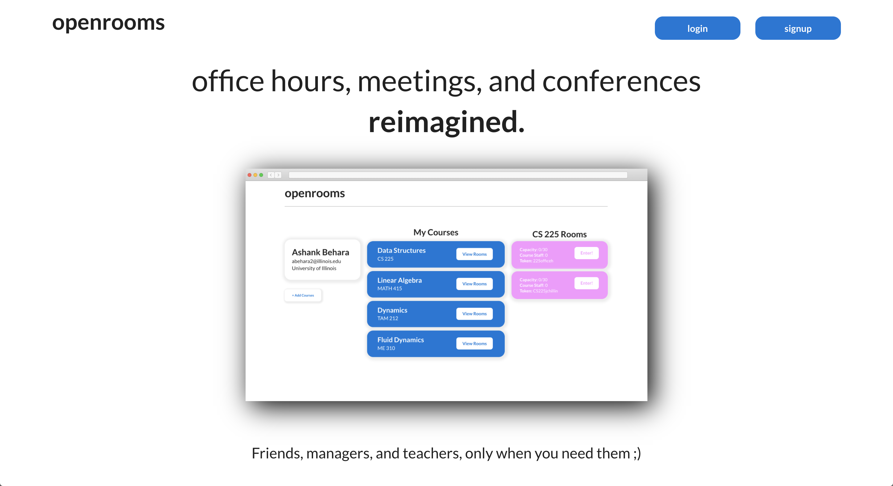

Ashank Behara, Zayyan Faizal, Gene Wang, Alice Fang

Having no access to office hours and no friends to study with, our team saw many students struggling with their classes. This inaccessibility to information due to COVID-19 led us to the creation of openrooms, an online collaboration platform that streamlines and interfaces abstract virtual office hours while connecting me with fellow peers in my classes.

Students can sign up for accounts providing the institution they attend. Using public course API’s we can load all available classes offered at a given university and allow students to add them to their profiles. Classes from this catalog can be added or deleted from a profile through our own APIs specific to users and courses. Additionally, every class maps to multiple virtual meeting rooms where students can collaborate in groups or course staff can hold office hours. Each room is uniquely identifiable with a token and is hosted using Twilio.

This platform is currently optimized for college students, but can easily be integrated with high schools, clubs, and corporations. This would allow teachers and managers to easily host virtual events outside of the traditional sphere, with a better breakout-room interface than Zoom and other video conferencing platforms. This platform is most similar to Slack, but with video chat as opposed to standard text.

Openrooms gives you friends, managers, and teachers, but only when you need them. Designed to help combat the isolation that this pandemic has brought, openrooms' unique functionality will long outlast our current situation and bring generations of academics closer together.
